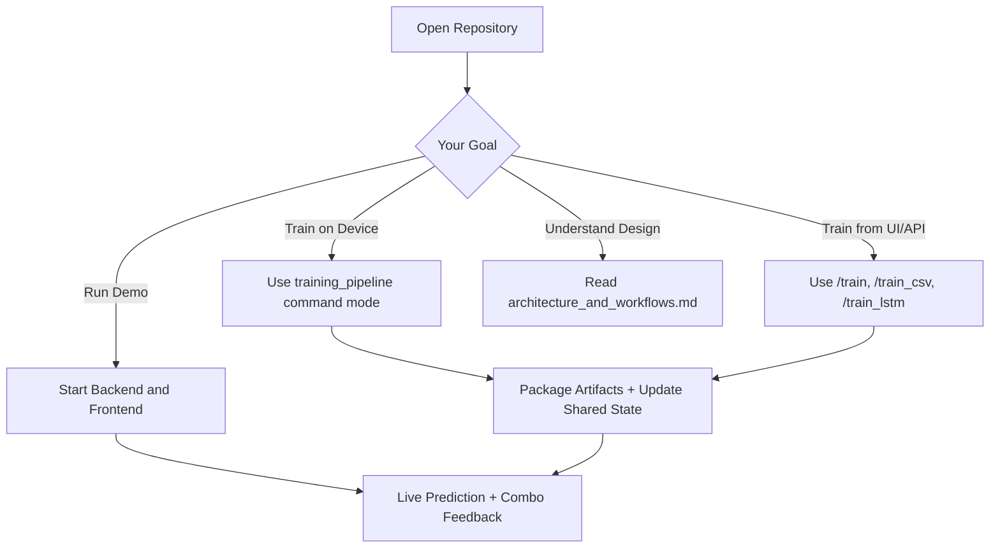
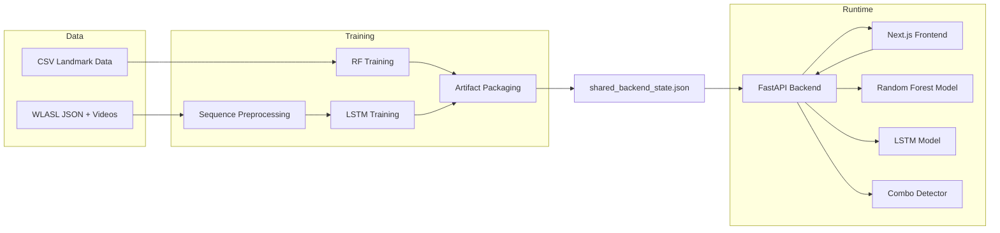
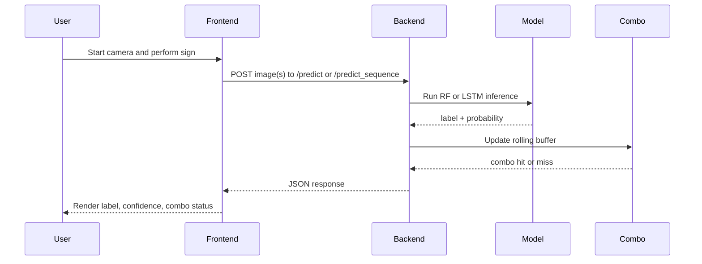
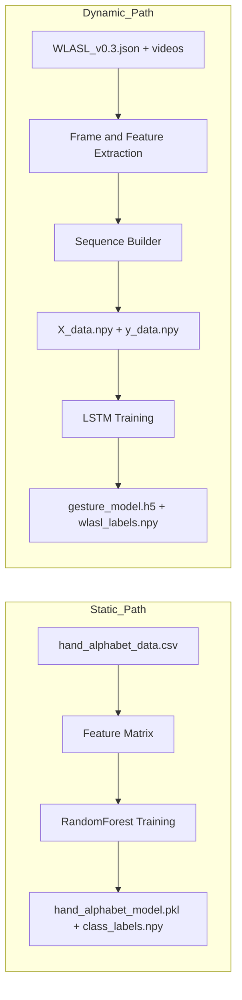
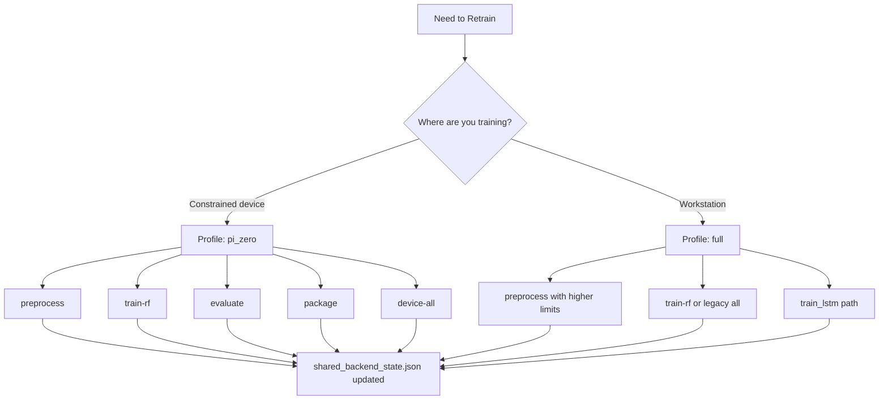
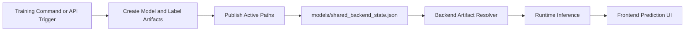
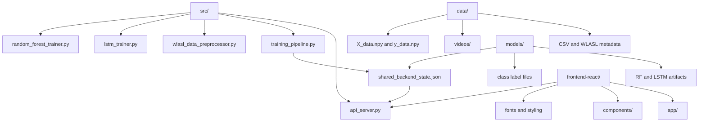

# Hand Sign Detection Dynamic

A full-stack hand sign recognition system built for practical experimentation and production-style iteration. It combines browser-based inference, profile-aware local training, and a shared artifact contract that keeps training and serving cleanly decoupled.

## Why This Project Is Useful

- Real-time sign prediction from webcam frames through a modern Next.js frontend.
- Dual modeling strategy: Random Forest for low-latency static gestures and LSTM for sequence-aware dynamic signs.
- Built-in combo detection that recognizes gesture phrases from a rolling prediction stream.
- Multiple training paths: browser-triggered API training, local device CLI workflow, and root orchestration pipeline.
- Shared backend state registry so active artifacts are consistently discoverable.

## Core Capabilities

| Capability | What It Does | Primary Files |
|---|---|---|
| Live Inference | Captures camera frames and returns label + confidence in near real time | `frontend-react/components/ui/demo.tsx`, `src/api_server.py` |
| Static Model Path | Trains/serves Random Forest from landmark-style features | `src/random_forest_trainer.py`, `src/api_server.py` |
| Dynamic Model Path | Trains/serves LSTM from fixed-length feature sequences | `src/wlasl_data_preprocessor.py`, `src/lstm_trainer.py` |
| Combo Layer | Matches recent predictions to predefined gesture templates | `src/api_server.py` |
| Device-Local Training | Profile-aware CLI for constrained hardware and packaging | `src/training_pipeline.py` |
| Shared Artifact Contract | Publishes active model/data paths for backend consumption | `src/shared_artifacts.py`, `models/shared_backend_state.json` |

## 90-Second Quickstart

### 1. Install Python dependencies

```bash
pip install -r requirements-runtime.txt
```

For full training workflows:

```bash
pip install -r requirements-training.txt
```

### 2. Start the FastAPI backend

```bash
python -m uvicorn src.api_server:app --host 127.0.0.1 --port 8000 --reload
```

### 3. Start the Next.js frontend

```bash
cd frontend-react
npm install
npm run dev -- --webpack
```

### 4. Open the app

- Frontend: `http://127.0.0.1:3000`
- Backend docs: `http://127.0.0.1:8000/docs`

## Start Path Guide



## System Architecture



## Inference Runtime Workflow



## Static vs Dynamic Pipeline



## Training Workflow Decision Tree



## Artifact Lifecycle



## Run and Train Commands

### Backend + Frontend

```bash
# Terminal 1
python -m uvicorn src.api_server:app --host 127.0.0.1 --port 8000 --reload

# Terminal 2
cd frontend-react
npm run dev -- --webpack
```

### Device-local trainer commands

```bash
# End-to-end local flow
python src/training_pipeline.py --command device-all --profile pi_zero --note "local run"

# Individual steps
python src/training_pipeline.py --command preprocess --profile pi_zero
python src/training_pipeline.py --command train-rf --profile pi_zero
python src/training_pipeline.py --command evaluate --profile pi_zero
python src/training_pipeline.py --command package --profile pi_zero
```

### Useful overrides for preprocessing

```bash
python src/training_pipeline.py --command preprocess --profile pi_zero --max-classes 12 --max-videos-per-class 4 --sequence-length 24 --frame-stride 2
```

### Legacy mode

```bash
python src/training_pipeline.py --model all
python src/training_pipeline.py --model random_forest
python src/training_pipeline.py --model lstm --data wlasl
```

### Root orchestrator

```bash
python model_training_orchestrator.py
```

## API Endpoint Summary

| Method | Endpoint | Purpose |
|---|---|---|
| POST | `/predict` | Single-frame prediction using Random Forest |
| POST | `/predict_sequence` | Sequence prediction using LSTM (expects 30 frames) |
| GET | `/combos` | List available combo templates and patterns |
| POST | `/clear_combos` | Clear combo buffer state |
| GET | `/` | Backend status with frontend URL hint |
| GET | `/artifacts` | Return active artifact registry |
| GET | `/training` | Training UI guidance endpoint |
| POST | `/train` | Train RF from uploaded image samples + labels |
| POST | `/train_csv` | Train RF from uploaded CSV |
| POST | `/process_wlasl` | Trigger WLASL preprocessing script |
| POST | `/train_lstm` | Trigger LSTM training script |

## Hardware Profiles

| Profile | Intended Hardware | Typical Usage |
|---|---|---|
| `pi_zero` | Raspberry Pi Zero 2 W or similar | On-device preprocessing, RF retraining, packaging |
| `full` | Workstation/laptop with stronger CPU/RAM | Larger preprocessing runs, broader experimentation, LSTM workflows |

## Repository Workflow Map



## Troubleshooting

### Frontend does not start in PowerShell

If script policy blocks npm, run via command shell:

```bash
cmd /c "cd frontend-react & npm run dev -- --webpack"
```

### Backend starts but file uploads fail

Install multipart support:

```bash
pip install python-multipart
```

### MediaPipe is unavailable

The backend includes a fallback feature extraction path based on grayscale histogram features, so inference can still run in constrained setups.

### TensorFlow warnings on Windows

GPU-related warnings are common on native Windows setups. CPU training and inference continue to work.

## Documentation and Deep Dives

- System and workflow deep dive: `architecture_and_workflows.md`
- Local trainer operations: `training_guide.md`
- FastAPI implementation: `src/api_server.py`
- Device trainer CLI implementation: `src/training_pipeline.py`

## Contributing

Contributions are welcome in model quality, data pipeline reliability, combo logic, and frontend usability. If you open a PR, include the command path you validated (`run`, `train-rf`, `device-all`, or API training endpoint) and any artifact changes produced.
