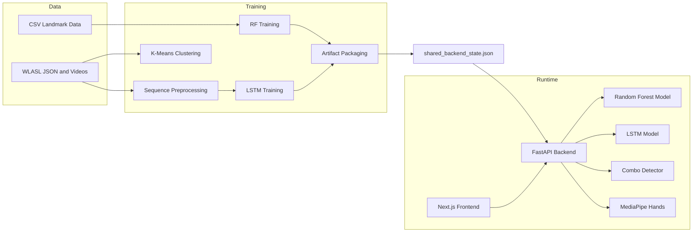
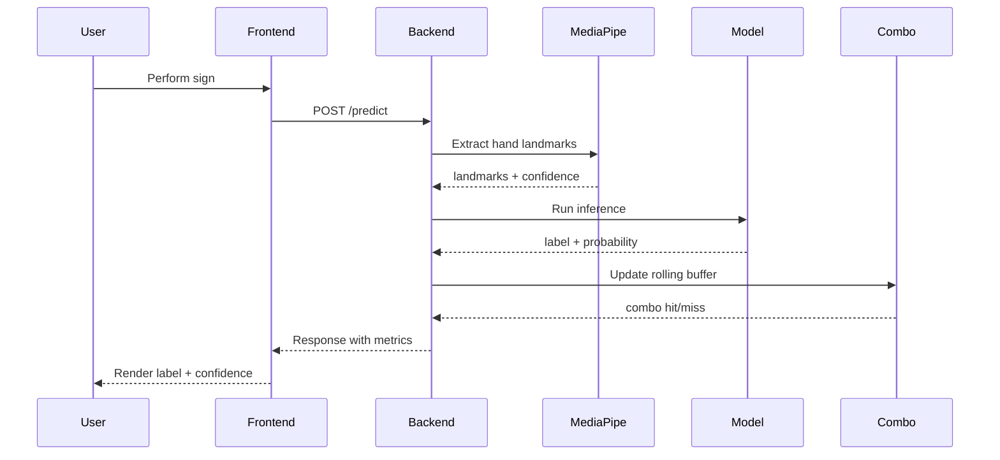

# Hand Sign Detection Dynamic

[](https://github.com/username/hand_sign_detection_dynamic/actions/workflows/ci.yml)
[](https://www.python.org/downloads/)
[](https://opensource.org/licenses/MIT)

A full-stack hand sign recognition platform with browser-based inference, profile-aware local training, unsupervised learning for gesture discovery, and a shared artifact contract between training and serving.

## Contents

1. [Overview](#overview)
2. [Repository Layout](#repository-layout)
3. [Quick Start](#quick-start)
4. [Feature Schema Contract](#feature-schema-contract)
5. [Training Options](#training-options)
6. [Unsupervised Learning](#unsupervised-learning)
7. [API Endpoints](#api-endpoints)
8. [Docker](#docker)
9. [System Diagrams](#system-diagrams)
10. [Related Docs](#related-docs)

## Overview

| Capability | Description |
|---|---|
| Live Inference | Webcam frames to label and confidence in near real time |
| Random Forest (Static) | Low-latency single-frame predictions |
| LSTM (Dynamic) | Sequence predictions from rolling frame windows |
| MediaPipe Integration | High-fidelity hand landmark detection with confidence scoring |
| Combo Detection | Phrase-level detection from recent prediction history |
| Unsupervised Learning | K-Means clustering and autoencoders for gesture discovery |
| Local Training | Profile-aware CLI for low-end and full hardware |
| API Training | Redis/RQ-queued training triggered through backend endpoints |
| Shared Artifact Registry | Stable handoff between training outputs and runtime loading |

Core contract:
- `models/shared_backend_state.json` is the source of truth for active runtime artifacts.

## Repository Layout

```text
hand_sign_detection_dynamic/
├── src/hand_sign_detection/         # Core application package
│   ├── api/                         # FastAPI application
│   │   ├── app.py                   # Application factory
│   │   ├── dependencies.py          # Dependency injection
│   │   └── routes/                  # API route modules
│   │       ├── health.py            # Health & metrics endpoints
│   │       ├── predict.py           # Prediction endpoints
│   │       ├── training.py          # Training endpoints
│   │       └── combos.py            # Combo detection endpoints
│   ├── core/                        # Core infrastructure
│   │   ├── config.py                # Pydantic Settings
│   │   ├── logging.py               # Logging setup
│   │   ├── redis.py                 # Redis client factory
│   │   └── shared_state.py          # Artifact registry
│   ├── models/                      # Model management
│   │   ├── manager.py               # Thread-safe ModelManager
│   │   └── features.py              # Feature extraction & MediaPipe
│   ├── services/                    # Business logic services
│   │   ├── prediction.py            # PredictionService with caching
│   │   ├── combo_detection.py       # Combo detector
│   │   └── rate_limiting.py         # Rate limiter
│   └── training/                    # Training components
│       ├── preprocessor.py          # WLASL preprocessor
│       ├── rf_trainer.py            # Random Forest trainer
│       ├── lstm_trainer.py          # LSTM trainer
│       ├── unsupervised.py          # Clustering & autoencoders
│       ├── artifact_manager.py      # Model packaging
│       └── job_queue.py             # Background job handling
├── data/                            # Training data
│   ├── videos/                      # WLASL video files
│   ├── WLASL_v0.3.json              # WLASL metadata
│   ├── X_data.npy                   # Preprocessed sequences
│   └── y_data.npy                   # Labels
├── models/                          # Trained models
│   ├── gesture_model.h5             # LSTM model
│   ├── hand_alphabet_model.pkl      # Random Forest model
│   └── shared_backend_state.json    # Artifact registry
├── tests/                           # Test suite
├── docker-compose.yml               # Container orchestration
├── Dockerfile.backend               # Multi-stage API image
├── Dockerfile.worker                # Worker image
├── requirements-runtime.txt         # Runtime dependencies
├── requirements-training.txt        # Training dependencies
└── pyproject.toml                   # Package configuration
```

## Quick Start

### 1. Install dependencies

```bash
# Runtime only
pip install -r requirements-runtime.txt

# Full training (includes TensorFlow)
pip install -r requirements-training.txt

# MediaPipe for hand landmarks (optional)
pip install mediapipe
```

### 2. Configure environment

Copy `.env.example` to `.env`, then set at least:

```bash
FEATURE_SCHEMA=histogram        # or 'mediapipe' for hand landmarks
TRAINING_API_KEY=your-secret-key
CORS_ORIGINS=http://localhost:3000
LOG_LEVEL=INFO
```

### 3. Start backend

```bash
# New modular architecture
uvicorn hand_sign_detection.api.app:app --host 127.0.0.1 --port 8000 --reload
```

### 4. Start frontend (optional)

```bash
echo "NEXT_PUBLIC_API_BASE_URL=http://127.0.0.1:8000" > frontend/.env.local
cd frontend && npm install && npm run dev
```

### 5. Open services

| URL | Purpose |
|---|---|
| `http://127.0.0.1:3000` | Frontend home |
| `http://127.0.0.1:3000/console` | Live detection console |
| `http://127.0.0.1:8000/docs` | Swagger UI |
| `http://127.0.0.1:8000/health/details` | Backend readiness |
| `http://127.0.0.1:8000/health/metrics` | Performance metrics |

## Feature Schema Contract

Training and serving must use the same `FEATURE_SCHEMA` value.

| Value | Feature Type | Dimension | Notes |
|---|---|---|---|
| `histogram` | Grayscale histogram | 8 | Fast default; no MediaPipe dependency |
| `mediapipe` | Hand landmark coordinates | 63 | Higher fidelity; requires MediaPipe |

MediaPipe features include:
- Hand detection with confidence scoring
- Bounding box extraction
- Left/Right hand classification
- 21 landmark points (x, y, z) per hand

## Training Options

### A. Device-local CLI

```bash
# Using new training module
python train_model.py
```

### B. API-triggered training (Redis/RQ)

Requires `X-API-Key: <TRAINING_API_KEY>`.

```text
POST /train          # Train RF from samples
POST /train_csv      # Train RF from CSV
POST /process_wlasl  # Build LSTM sequences
POST /train_lstm     # Train LSTM model
GET  /jobs/{job_id}  # Check job status
```

### C. Google Colab Training

For GPU-accelerated training:
```bash
# Upload to Google Colab
lstm_model_training.ipynb
```

## Unsupervised Learning

Discover gesture patterns in unlabeled data:

```python
from hand_sign_detection.training import UnsupervisedTrainer

trainer = UnsupervisedTrainer()

# Run K-Means clustering to discover gesture groups
result = trainer.train_clustering(auto_select_k=True)
print(f"Found {result.n_clusters} clusters")
print(f"Silhouette score: {result.silhouette_score}")

# Train autoencoder for feature learning
ae_result = trainer.train_autoencoder(encoding_dim=16)
print(f"Reconstruction loss: {ae_result.reconstruction_loss}")

# Full analysis
results = trainer.analyze_data()
```

## API Endpoints

| Method | Endpoint | Auth | Purpose |
|---|---|---|---|
| POST | `/predict` | None | Single-frame RF prediction |
| POST | `/predict_sequence` | None | Sequence LSTM prediction |
| GET | `/combos` | None | List combo templates |
| POST | `/clear_combos` | None | Reset combo state |
| GET | `/artifacts` | None | Current artifact registry |
| GET | `/health/live` | None | Liveness check |
| GET | `/health/ready` | None | Readiness check |
| GET | `/health/details` | None | Runtime details |
| GET | `/health/metrics` | None | Performance metrics |
| POST | `/health/metrics/reset` | None | Reset metrics |
| POST | `/train` | API key | Train RF from samples |
| POST | `/train_csv` | API key | Train RF from CSV |
| GET | `/jobs/{job_id}` | None | Check job status |

## Docker

```bash
# Backend + Redis only
docker compose up --build

# Full stack (frontend + worker)
docker compose --profile full up --build

# With worker for background training
docker compose --profile worker up --build
```

Environment variables:
```bash
BACKEND_PORT=8000
FRONTEND_PORT=3000
REDIS_PORT=6379
LOG_LEVEL=INFO
FEATURE_SCHEMA=histogram
TRAINING_API_KEY=your-secret-key
```

| URL | Service |
|---|---|
| `http://localhost:3000` | Frontend |
| `http://localhost:8000` | Backend |
| `http://localhost:8000/health/ready` | Readiness probe |

## System Diagrams

### Architecture overview



### Inference flow



## Related Docs

| Document | Contents |
|---|---|
| `architecture_and_workflows.md` | System design, data flows |
| `training_guide.md` | Local training, device profiles |
| `DEPLOYMENT.md` | Production deployment guide |
| `QUICKSTART.md` | Quick setup instructions |
| `docs/PERFORMANCE.md` | Benchmarking and optimization |
| `docs/SECRETS.md` | Secrets management guide |
| `docs/FRONTEND.md` | Frontend setup and development |

---

## Troubleshooting

**Backend starts but file uploads fail**
```bash
pip install python-multipart
```

**MediaPipe unavailable**
Use `FEATURE_SCHEMA=histogram` — no MediaPipe required.

**TensorFlow GPU warnings on Windows**
Expected on native Windows. CPU inference works normally.

**Import errors after refactoring**
Ensure `PYTHONPATH` includes `src/`:
```bash
export PYTHONPATH=$PYTHONPATH:$(pwd)/src
```
