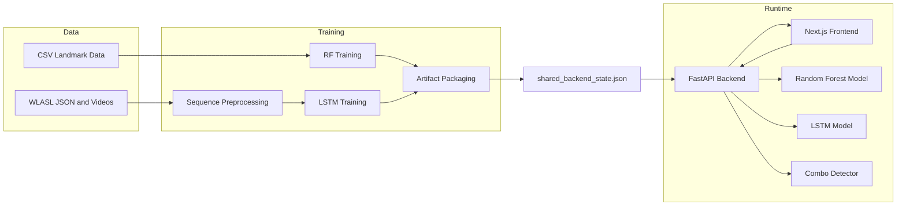
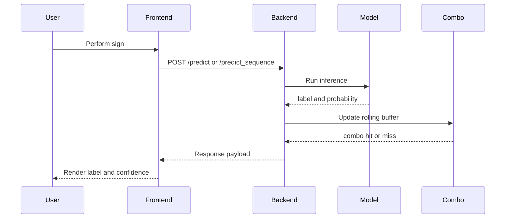
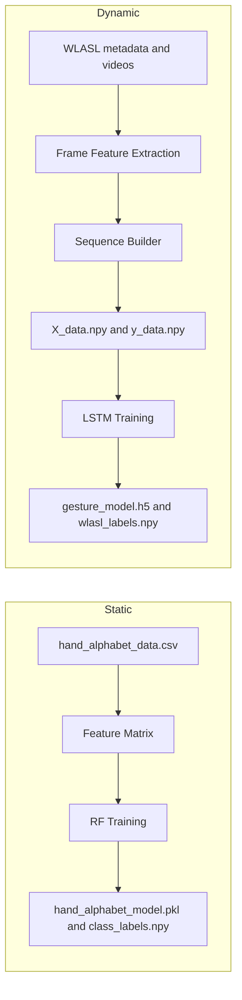

# Hand Sign Detection Dynamic

A full-stack hand sign recognition platform with browser-based inference, profile-aware local training, and a shared artifact contract between training and serving.

## Contents

1. [Overview](#overview)
2. [Repository Layout](#repository-layout)
3. [Quick Start](#quick-start)
4. [Feature Schema Contract](#feature-schema-contract)
5. [Training Options](#training-options)
6. [API Endpoints](#api-endpoints)
7. [Docker](#docker)
8. [System Diagrams](#system-diagrams)
9. [Related Docs](#related-docs)

## Overview

| Capability | Description |
|---|---|
| Live Inference | Webcam frames to label and confidence in near real time |
| Random Forest (Static) | Low-latency single-frame predictions |
| LSTM (Dynamic) | Sequence predictions from rolling frame windows |
| Combo Detection | Phrase-level detection from recent prediction history |
| Local Training | Profile-aware CLI for low-end and full hardware |
| API Training | Redis/RQ-queued training triggered through backend endpoints |
| Shared Artifact Registry | Stable handoff between training outputs and runtime loading |

Core contract:
- `models/shared_backend_state.json` is the source of truth for active runtime artifacts.

## Repository Layout

```text
hand_sign_detection_dynamic/
├── src/
│   ├── api_server.py
│   ├── shared_artifacts.py
│   ├── job_queue.py
│   ├── worker.py
│   ├── training_pipeline.py
│   ├── wlasl_data_preprocessor.py
│   ├── random_forest_trainer.py
│   ├── lstm_trainer.py
│   ├── streamlit_app.py
│   └── training_module/
│       ├── config.py
│       ├── features.py
│       ├── service.py
│       ├── jobs.py
│       └── cli.py
├── frontend/
├── data/
├── models/
├── reports/
├── docker-compose.yml
├── Dockerfile.backend
├── Dockerfile.worker
├── requirements-runtime.txt
├── requirements-training.txt
├── requirements-device.txt
├── architecture_and_workflows.md
└── training_guide.md
```

## Quick Start

### 1. Install dependencies

```bash
# Runtime only
pip install -r requirements-runtime.txt

# Full training
pip install -r requirements-training.txt
```

### 2. Configure environment

Copy `.env.example` to `.env`, then set at least:

```bash
FEATURE_SCHEMA=histogram
TRAINING_API_KEY=your-secret-key
CORS_ORIGINS=http://localhost:3000
```

### 3. Start backend

```bash
python -m uvicorn src.api_server:app --host 127.0.0.1 --port 8000 --reload
```

### 4. Start frontend

```bash
echo "NEXT_PUBLIC_API_BASE_URL=http://127.0.0.1:8000" > frontend/.env.local
cd frontend
npm install
npm.cmd run dev
```

### 5. Open services

| URL | Purpose |
|---|---|
| `http://127.0.0.1:3000` | Frontend home |
| `http://127.0.0.1:3000/console` | Live detection console |
| `http://127.0.0.1:8000/docs` | Swagger UI |
| `http://127.0.0.1:8000/health/details` | Backend readiness and loaded artifacts |

## Feature Schema Contract

Training and serving must use the same `FEATURE_SCHEMA` value.

| Value | Feature Type | Dimension | Notes |
|---|---|---|---|
| `histogram` | Grayscale histogram | 8 | Fast default; no MediaPipe dependency |
| `mediapipe` | Hand landmark coordinates | 63 | Higher fidelity; requires MediaPipe |

Behavioral guarantees:
- Backend validates feature dimension compatibility on model load and inference.
- In `mediapipe` mode with no hand detected, extractor emits a zero vector of length 63.

## Training Options

### A. Device-local CLI

```bash
# Full workflow
python src/training_pipeline.py --command device-all --profile pi_zero --note "local run"

# Common step-by-step commands
python src/training_pipeline.py --command preprocess --profile pi_zero
python src/training_pipeline.py --command train-rf --profile pi_zero
python src/training_pipeline.py --command evaluate --profile pi_zero
python src/training_pipeline.py --command package --profile pi_zero
python src/training_pipeline.py --command export-data --profile pi_zero
```

Override preprocessing limits:

```bash
python src/training_pipeline.py --command preprocess --profile pi_zero \
  --max-classes 12 --max-videos-per-class 4 --sequence-length 24 --frame-stride 2
```

### B. API-triggered training (Redis/RQ)

Requires `X-API-Key: <TRAINING_API_KEY>`.

```text
POST /train
POST /train_csv
POST /process_wlasl
POST /train_lstm
GET  /jobs/{job_id}
```

### C. Legacy orchestrator

```bash
python model_training_orchestrator.py
```

### Hardware profiles

| Profile | Target | Typical use |
|---|---|---|
| `pi_zero` | Raspberry Pi Zero 2 W | Lightweight preprocessing and RF retraining |
| `full` | Laptop/workstation | Larger dataset and LSTM-heavy workflows |

## API Endpoints

| Method | Endpoint | Auth | Purpose |
|---|---|---|---|
| POST | `/predict` | None | Single-frame RF prediction |
| POST | `/predict_sequence` | None | Sequence LSTM prediction |
| GET | `/combos` | None | List combo templates |
| POST | `/clear_combos` | None | Reset combo state |
| GET | `/artifacts` | None | Current artifact registry |
| GET | `/health/live` | None | Liveness check |
| GET | `/health/ready` | None | Readiness check |
| GET | `/health/details` | None | Readiness plus runtime details |
| POST | `/train` | API key | Train RF from image samples |
| POST | `/train_csv` | API key | Train RF from CSV |
| POST | `/process_wlasl` | API key | Build LSTM sequences |
| POST | `/train_lstm` | API key | Train LSTM model |
| GET | `/jobs/{job_id}` | None | Check training job status |

Rate-limit environment variables:

```text
RATE_LIMIT_WINDOW_SECONDS
MAX_PREDICT_REQUESTS_PER_WINDOW
MAX_SEQUENCE_REQUESTS_PER_WINDOW
MAX_TRAIN_REQUESTS_PER_WINDOW
MAX_CONCURRENT_SEQUENCE_REQUESTS
```

For multi-instance deployments, configure `REDIS_URL` to share state and limits.

## Docker

```bash
docker compose up --build
```

| URL | Service |
|---|---|
| `http://localhost:3000` | Frontend |
| `http://localhost:8000` | Backend |
| `http://localhost:8000/health/ready` | Readiness probe |

## System Diagrams

### Architecture overview



### Inference flow



### Static vs dynamic training



## Related Docs

- `architecture_and_workflows.md` for system design and execution flow details.
- `training_guide.md` for profile-based local training operations.

  classDef static fill:#06b6d4,stroke:#0e7490,color:#083344,stroke-width:2px;
  classDef dynamic fill:#a78bfa,stroke:#7c3aed,color:#2e1065,stroke-width:2px;
  classDef artifact fill:#f59e0b,stroke:#b45309,color:#451a03,stroke-width:2px;
  class S1,S2,S3 static;
  class D1,D2,D3,D5 dynamic;
  class S4,D4,D6 artifact;
```

---

## Troubleshooting

**Frontend does not start in PowerShell**
```bash
cmd /c "cd frontend && npm.cmd run dev"
```

**Backend starts but file uploads fail**
```bash
pip install python-multipart
```

**MediaPipe unavailable**
Use `FEATURE_SCHEMA=histogram` — no MediaPipe required, works on constrained hardware.

**TensorFlow GPU warnings on Windows**
Expected on native Windows. CPU training and inference continue to work normally.

---

## Further Reading

| Document | Contents |
|---|---|
| `architecture_and_workflows.md` | System design, component interactions, data flows |
| `training_guide.md` | Local training operations, device profiles, packaging |
| `src/api_server.py` | Full FastAPI implementation with inline comments |
| `src/training_pipeline.py` | Device trainer CLI implementation |
