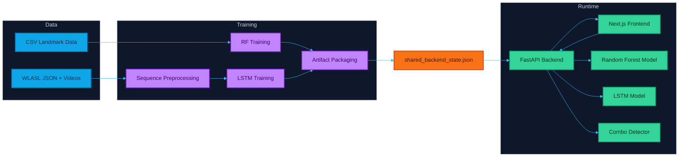
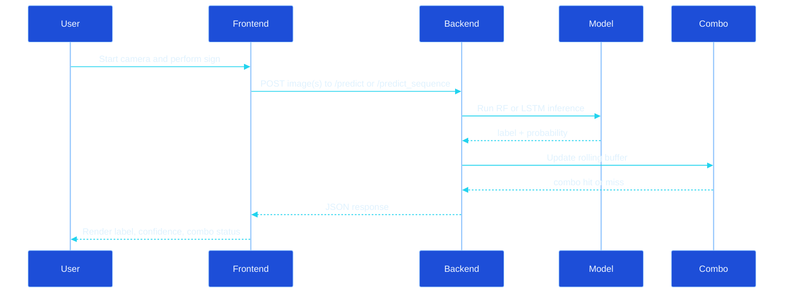
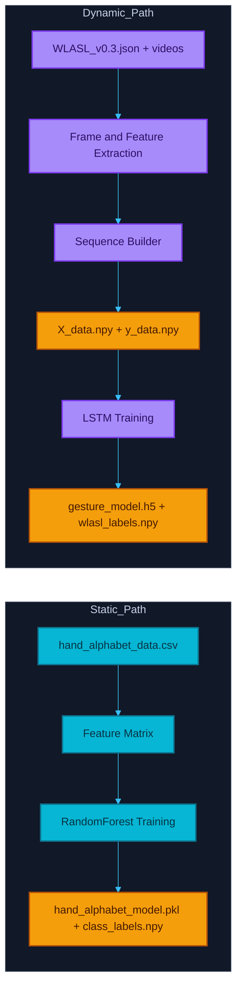

# Hand Sign Detection Dynamic

A full-stack hand sign recognition system combining browser-based live inference, profile-aware local training, and a shared feature contract that keeps training and serving cleanly decoupled.

---

## Table of Contents

1. [What It Does](#what-it-does)
2. [Project Structure](#project-structure)
3. [Quickstart](#quickstart)
4. [Feature Schema Contract](#feature-schema-contract)
5. [Training](#training)
6. [API Reference](#api-reference)
7. [Docker](#docker)
8. [System Diagrams](#system-diagrams)
9. [Troubleshooting](#troubleshooting)
10. [Further Reading](#further-reading)

---

## What It Does

| Capability | Description |
|---|---|
| **Live Inference** | Webcam frames → label + confidence in near real time |
| **Random Forest (Static)** | Low-latency single-frame predictions from landmark-style features |
| **LSTM (Dynamic)** | Sequence-aware predictions from rolling 30-frame windows |
| **Combo Detection** | Recognises gesture phrases from a rolling prediction buffer |
| **Device Training** | Profile-aware CLI training that runs on Pi Zero or workstation |
| **API Training** | Browser/API-triggered training queued through Redis + RQ |
| **Shared Artifact Contract** | One registry file keeps model paths consistent between training and serving |

---

## Project Structure

```
hand_sign_detection_dynamic/
│
├── src/                            # All backend Python source
│   ├── api_server.py               # FastAPI app — inference, health, training endpoints
│   ├── shared_artifacts.py         # Reads/writes models/shared_backend_state.json
│   ├── job_queue.py                # Redis/RQ job submission helpers
│   ├── worker.py                   # RQ worker entry point for training jobs
│   ├── training_pipeline.py        # Device-local CLI trainer (wraps training_module)
│   ├── wlasl_data_preprocessor.py  # WLASL video → feature sequence preprocessor
│   │
│   ├── training_module/            # Canonical training package (used by all entry points)
│   │   ├── config.py               # Feature schema, device profiles, shared constants
│   │   ├── features.py             # Shared feature extraction (histogram or mediapipe)
│   │   ├── service.py              # RF + LSTM training, evaluation, artifact publishing
│   │   ├── jobs.py                 # RQ job handlers (called by worker.py)
│   │   ├── cli.py                  # CLI entry used by training_pipeline.py
│   │   └── __init__.py
│   │
│   │   # Legacy wrappers — kept for backward compatibility, thin shells only:
│   ├── random_forest_trainer.py    # → delegates to training_module
│   ├── lstm_trainer.py             # → delegates to training_module
│   └── streamlit_app.py            # Optional Streamlit debug UI
│
├── frontend/                       # Next.js 16 + React 19 + TypeScript + Tailwind
│   └── app/
│       ├── page.tsx                # Landing page with project overview and Get Started CTA
│       ├── console/
│       │   └── page.tsx            # Live detection console (camera + prediction + calibration)
│       ├── types.ts                # Shared TypeScript types (PredictionResponse, etc.)
│       ├── layout.tsx
│       ├── globals.css
│       ├── hooks/                  # Domain-separated React hooks
│       │   ├── useCameraCapture.ts # Camera stream, frame capture, calibration images
│       │   ├── usePredictionLoop.ts# Adaptive prediction loop + backend health ping
│       │   └── useCalibrationFlow.ts # Calibration session management
│       └── components/
│           ├── ControlButton.tsx   # Reusable HUD button
│           ├── MetricTile.tsx      # Status metric display card
│           └── GestureTimeline.tsx # Mission-log gesture history
│
├── data/                           # Training data (not committed to git)
│   ├── hand_alphabet_data.csv      # Static gesture CSV (RF training)
│   ├── WLASL_v0.3.json             # WLASL metadata
│   ├── videos/                     # WLASL video clips
│   ├── X_data.npy                  # Preprocessed LSTM feature sequences
│   ├── y_data.npy                  # Preprocessed LSTM labels
│   └── wlasl_labels.npy            # Class label array for LSTM
│
├── models/                         # Trained artifacts (not committed to git)
│   ├── shared_backend_state.json   # ← Active artifact registry (training writes, API reads)
│   ├── gesture_model.h5            # LSTM model
│   ├── class_labels.npy            # RF class labels
│   └── wlasl_labels.npy            # LSTM class labels
│
├── reports/                        # Evaluation output (confusion matrices, metrics)
│
├── .env.example                    # Template for all environment variables
├── docker-compose.yml              # Backend + frontend + Redis + worker
├── Dockerfile.backend
├── Dockerfile.worker
├── requirements-runtime.txt        # Inference-only dependencies
├── requirements-training.txt       # Full training dependencies
├── requirements-device.txt         # Lightweight dependencies for constrained devices
├── architecture_and_workflows.md   # Deep-dive design notes
└── training_guide.md               # Local training operations guide
```

> **Key insight:** `models/shared_backend_state.json` is the handoff point between training and serving. Training writes the active artifact paths here; the API reads from it on startup and on each model reload.

---

## Quickstart

### 1. Python dependencies

```bash
# Inference only
pip install -r requirements-runtime.txt

# Full training support
pip install -r requirements-training.txt
```

### 2. Environment

Copy `.env.example` to `.env` and configure at minimum:

```bash
FEATURE_SCHEMA=histogram          # or: mediapipe
TRAINING_API_KEY=your-secret-key  # secures /train and related endpoints
CORS_ORIGINS=http://localhost:3000
```

### 3. Start the backend

```bash
python -m uvicorn src.api_server:app --host 127.0.0.1 --port 8000 --reload
```

### 4. Start the frontend

```bash
# Create frontend/.env.local
echo "NEXT_PUBLIC_API_BASE_URL=http://127.0.0.1:8000" > frontend/.env.local

cd frontend
npm install
npm.cmd run dev    # use npm.cmd in PowerShell
```

### 5. Open the app

| URL | Purpose |
|---|---|
| `http://127.0.0.1:3000` | Home page with project overview and Get Started flow |
| `http://127.0.0.1:3000/console` | Live detection console |
| `http://127.0.0.1:8000/docs` | Interactive API docs (Swagger) |
| `http://127.0.0.1:8000/health/details` | Backend readiness + loaded artifacts |

Navigation note:
- Start at `/` to review scope and system context.
- Click **Get Started** to open `/console`.

---

## Feature Schema Contract

Training and inference share one explicit feature contract set by `FEATURE_SCHEMA`:

| Value | Feature Type | Dimension | Notes |
|---|---|---|---|
| `histogram` | Grayscale histogram | 8 | Default. Fast, no MediaPipe required |
| `mediapipe` | Hand landmark coords | 63 | Better accuracy, requires MediaPipe |

**Both training and serving must use the same value.** The backend validates model feature dimensions on load and rejects mismatched inputs at inference time instead of silently padding or truncating.

When no hand is detected in `mediapipe` mode, the extractor returns a zero vector of dimension 63 (not a histogram fallback) so the feature contract stays consistent.

---

## Training

### Option A — Device-local CLI

```bash
# Full end-to-end run
python src/training_pipeline.py --command device-all --profile pi_zero --note "local run"

# Individual steps
python src/training_pipeline.py --command preprocess --profile pi_zero
python src/training_pipeline.py --command train-rf   --profile pi_zero
python src/training_pipeline.py --command evaluate   --profile pi_zero
python src/training_pipeline.py --command package    --profile pi_zero

# Override preprocessing limits
python src/training_pipeline.py --command preprocess --profile pi_zero \
  --max-classes 12 --max-videos-per-class 4 --sequence-length 24 --frame-stride 2
```

### Option B — API / browser-triggered (queued via Redis)

Requires `X-API-Key: <TRAINING_API_KEY>` header.

```
POST /train           Train RF from uploaded image samples
POST /train_csv       Train RF from uploaded CSV
POST /process_wlasl   Preprocess WLASL videos
POST /train_lstm      Train LSTM from preprocessed sequences

GET  /jobs/{job_id}   Check training job status
```

### Option C — Root orchestrator (legacy)

```bash
python model_training_orchestrator.py
```

### Hardware profiles

| Profile | Target hardware | Typical use |
|---|---|---|
| `pi_zero` | Raspberry Pi Zero 2 W | On-device preprocessing and RF retraining |
| `full` | Workstation / laptop | Larger runs, LSTM workflows |

---

## API Reference

| Method | Endpoint | Auth | Purpose |
|---|---|---|---|
| `POST` | `/predict` | — | Single-frame RF prediction |
| `POST` | `/predict_sequence` | — | 30-frame LSTM sequence prediction |
| `GET` | `/combos` | — | List combo templates |
| `POST` | `/clear_combos` | — | Reset combo buffer |
| `GET` | `/artifacts` | — | Active artifact registry |
| `GET` | `/health/live` | — | Liveness check |
| `GET` | `/health/ready` | — | Model readiness check |
| `GET` | `/health/details` | — | Readiness + limits + loaded artifact state |
| `POST` | `/train` | API key | Train RF from uploaded samples |
| `POST` | `/train_csv` | API key | Train RF from CSV |
| `POST` | `/process_wlasl` | API key | WLASL preprocessing |
| `POST` | `/train_lstm` | API key | LSTM training |
| `GET` | `/jobs/{job_id}` | — | Training job status |

### Rate limit environment variables

```
RATE_LIMIT_WINDOW_SECONDS
MAX_PREDICT_REQUESTS_PER_WINDOW
MAX_SEQUENCE_REQUESTS_PER_WINDOW
MAX_TRAIN_REQUESTS_PER_WINDOW
MAX_CONCURRENT_SEQUENCE_REQUESTS
```

For multi-instance deployments, set `REDIS_URL` to share rate limits and combo state across replicas.

---

## Docker

```bash
# Build and start backend + frontend + Redis + worker
docker compose up --build
```

| URL | Service |
|---|---|
| `http://localhost:3000` | Frontend |
| `http://localhost:8000` | Backend |
| `http://localhost:8000/health/ready` | Readiness probe |

---

## System Diagrams

### Architecture overview



### Inference request flow



### Static vs dynamic training pipelines



---

## Troubleshooting

**Frontend does not start in PowerShell**
```bash
cmd /c "cd frontend && npm.cmd run dev"
```

**Backend starts but file uploads fail**
```bash
pip install python-multipart
```

**MediaPipe unavailable**
Use `FEATURE_SCHEMA=histogram` — no MediaPipe required, works on constrained hardware.

**TensorFlow GPU warnings on Windows**
Expected on native Windows. CPU training and inference continue to work normally.

---

## Further Reading

| Document | Contents |
|---|---|
| `architecture_and_workflows.md` | System design, component interactions, data flows |
| `training_guide.md` | Local training operations, device profiles, packaging |
| `src/api_server.py` | Full FastAPI implementation with inline comments |
| `src/training_pipeline.py` | Device trainer CLI implementation |
