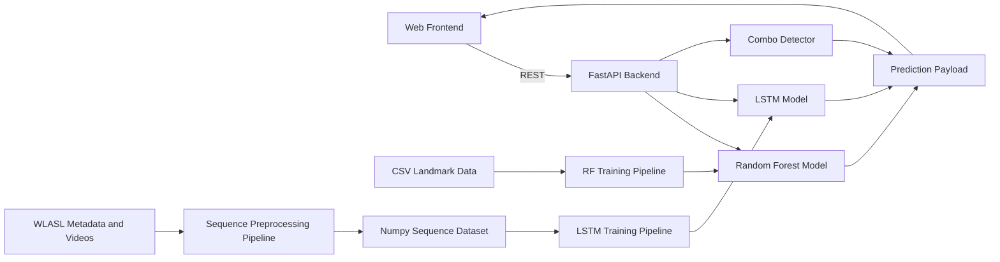
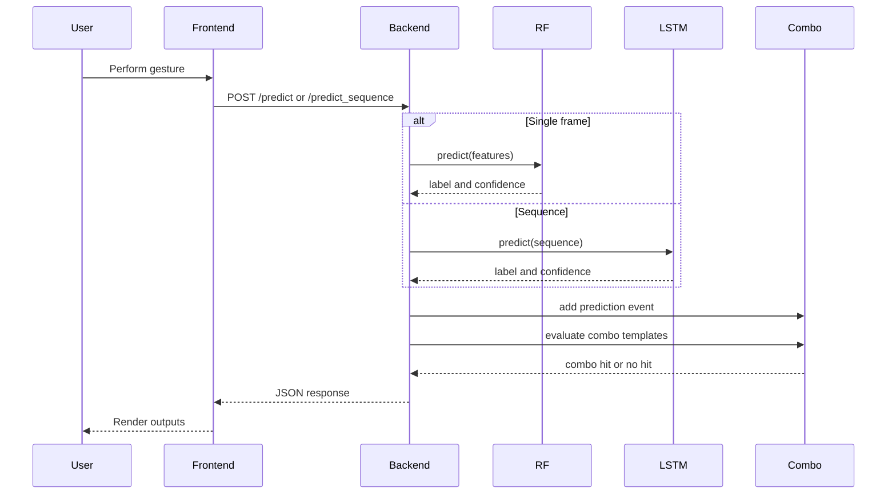
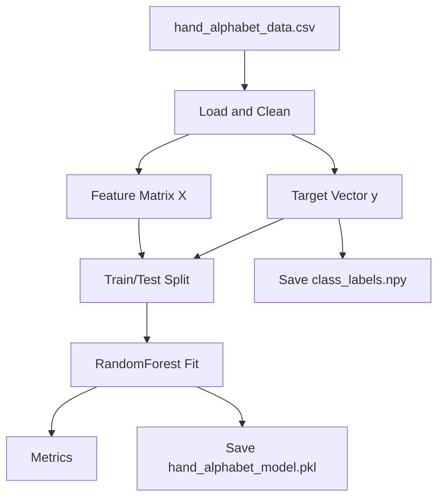
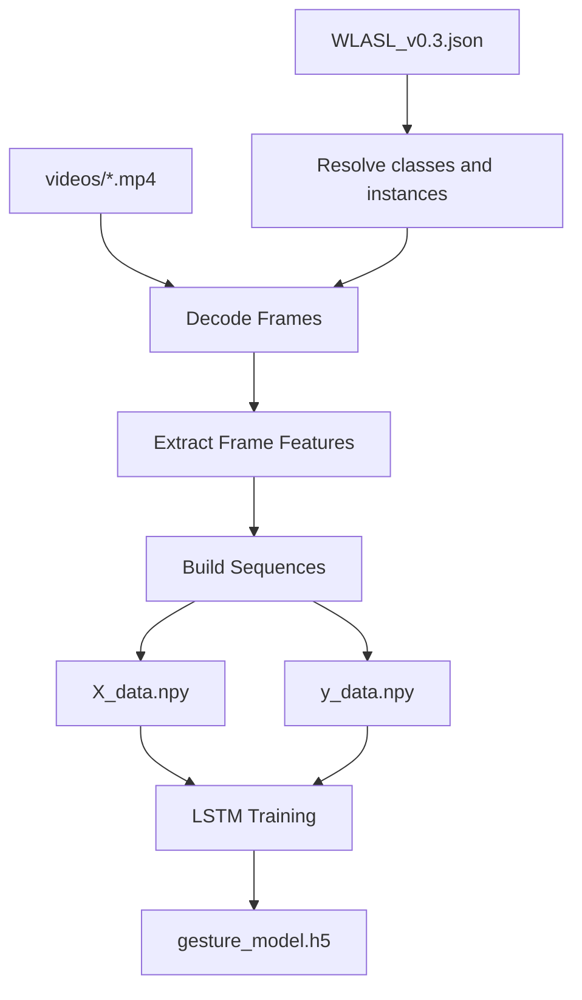
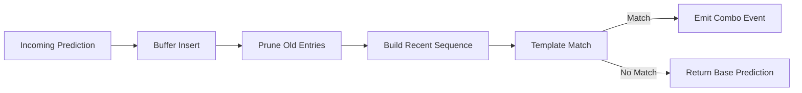
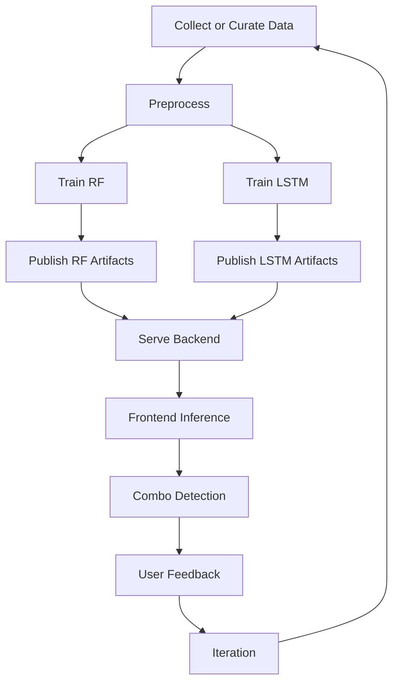

# Architecture and Workflows

This document describes how the hand sign detection system is organized, how data flows across components, and why the design supports maintainability and iteration.

## 1. Purpose

The platform combines:
- Static alphabet classification with Random Forest.
- Dynamic sequence classification with LSTM.
- Real-time browser inference through a FastAPI backend.
- End-to-end model lifecycle support: preprocessing, training, evaluation, and artifact publishing.

## 2. System Architecture

## 3. Runtime Inference Workflow

High-level runtime behavior:
1. User starts camera stream from the frontend.
2. Frontend sends frame or sequence payloads to backend endpoints.
3. Backend executes RF or LSTM inference.
4. Prediction results are added to combo history.
5. Backend returns prediction metadata and combo information.

## 4. Data Pipelines

### 4.1 Static Pipeline (CSV to Random Forest)

Input contract:
- Rows represent samples.
- Feature columns contain flattened hand features.
- Last column is the class label.

Pipeline:
1. Load CSV and drop invalid rows.
2. Split into features (`X`) and labels (`y`).
3. Train/validation split.
4. Train Random Forest model.
5. Evaluate and publish artifacts.

### 4.2 Dynamic Pipeline (WLASL to LSTM)

Input contract:
- WLASL metadata JSON for class and clip mapping.
- Video files for frame extraction.

Pipeline:
1. Parse metadata and enumerate clips.
2. Decode video frames.
3. Extract per-frame features.
4. Build fixed-length sequences.
5. Persist `X_data.npy` and `y_data.npy`.
6. Train LSTM model.
7. Save `gesture_model.h5` and labels.

## 5. Combo Detection

Combo detection adds temporal semantics on top of base model predictions.

Core logic:
- Insert new predictions into a bounded rolling buffer.
- Remove expired or low-confidence entries.
- Compare recent sequence against combo templates.
- Emit combo event when a template matches.

## 6. Artifact Roles

- `models/hand_alphabet_model.pkl`: static RF classifier.
- `models/class_labels.npy`: RF output label map.
- `models/gesture_model.h5`: dynamic LSTM classifier.
- `models/wlasl_labels.npy`: LSTM label map.
- `data/X_data.npy`, `data/y_data.npy`: prepared sequence dataset.
- `models/shared_backend_state.json`: active runtime artifact registry.

This separation keeps model lifecycle updates independent of API and frontend code changes.

## 7. API Behavior Summary

The backend exposes endpoints for:
- Health and readiness.
- Single-frame prediction.
- Sequence prediction.
- Combo state reset and inspection.
- Training orchestration (authenticated endpoints).

Responses consistently return prediction metadata, allowing the frontend to remain model-agnostic.

## 8. Frontend Responsibilities

The frontend is responsible for:
- Camera stream control.
- Prediction trigger and polling behavior.
- Rendering labels, confidence, and model context.
- Displaying combo history and detected phrases.

Business logic and model operations remain in backend services.

## 9. Reliability and Performance

### 9.1 Latency drivers

Primary latency contributors:
- Feature extraction.
- Model inference.
- API roundtrip and payload handling.

RF typically delivers faster single-frame inference; LSTM is heavier because it processes temporal windows.

### 9.2 Drift and retraining

Model quality may drop under changing camera, lighting, or user motion patterns. The training pipelines support periodic retraining and artifact refresh.

### 9.3 Dependency fallback

When optional dependencies are unavailable, fallback extraction paths allow partial system operation and improve portability.

## 10. End-to-End Workflow

## 11. Design Rationale

The design is intentionally modular:
- Data engineering is isolated from serving.
- Static and dynamic models are trained in dedicated paths.
- Combo logic is independent from model internals.
- Frontend communicates through a stable API contract.

This modularity supports maintainability, safer changes, and faster experimentation.
